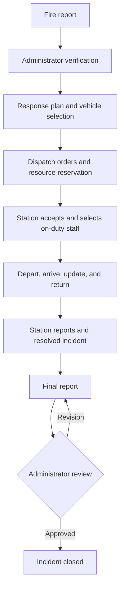

# Fire Report and Route System

A Django application for reporting fires and coordinating station responses in Mandalay, Myanmar. The emergency console connects citizen reports, administrator review, vehicle dispatch, firefighter participation, and final incident reporting in one workflow.

## Overview

The application uses Django, MySQL (default) or SQLite for a local demo, Leaflet maps, and a local OpenStreetMap road graph. Myanmar and English interfaces, date formatting, and Myanmar/Latin PDF fonts support local use.

Core features include:

- Citizen registration and fire reports with coordinates or a manual address.
- Administrator confirmation of location, station jurisdiction, and fire level.
- Response plans, resource previews, vehicle reservation, and additional dispatch waves.
- Station-scoped staff management, duty schedules, leave approval, and temporary station managers.
- Deployment updates, actual vehicle/personnel participation, station reports, and final review.
- Role-scoped dashboards, maps, notifications, posts, filters, and pagination.
- Local Dijkstra road routing and incident/route PDF exports.

This is a demonstration system. Station references, response quantities, and routes require local verification before operational use. Routing does not model traffic or live vehicle positions.

## Roles

| Role | Responsibilities |
| --- | --- |
| Citizen | Register, report a fire, and view permitted incident information. |
| Administrator | Verify reports, confirm coordinates and jurisdiction, choose response resources, dispatch, and review final reports. |
| Station Admin | Manage permitted station resources and staff, select personnel, update deployments, and submit reports. |
| Firefighter | Participate in assigned responses and access permitted staff information. |

Approved, time-limited acting assignments allow a replacement to manage a station while its manager is on leave.

## Incident workflow

1. **Report:** A signed-in citizen or staff member submits the location and fire details. The report enters the pending queue.
2. **Verify:** An administrator checks the report, confirms coordinates, assigns the home/lead station and fire level, or records a false alarm.
3. **Plan and dispatch:** The administrator previews the response plan, checks shortages, and selects available vehicles. Dispatch reserves vehicles and creates station deployment orders and notifications. Additional waves can be dispatched as needed.
4. **Assign personnel:** The station manager selects active, on-duty firefighters who are not on approved leave or already assigned to another active response.
5. **Respond:** The station records acceptance, departure, arrival, operational updates, and return. Actual vehicle and staff participation is recorded; returned resources become available again.
6. **Report:** Each station submits its narrative and water usage. Once the incident is resolved, the lead station or administrator submits a final report with aggregated resources.
7. **Review and close:** An administrator approves the final report or requests revision. Approval closes the resolved incident once all deployments have returned or been cancelled.



Deployment states are `Ordered → Accepted → Departed → Arrived → Returned`, with cancellation supported by the workflow. Notifications and order acceptance have separate states. Permissions, resource reservations, and audit records are enforced by the emergency service layer.

## Local setup

Prerequisites: Python 3.13, Pipenv, and MySQL 8.0 or newer for the default database. Use SQLite for a simpler local demo.

Run these PowerShell commands from the repository root:

```powershell
cd fire_route_system
python -m pip install pipenv
pipenv sync
Copy-Item .env.example .env
```

Edit `.env` with a private `SECRET_KEY` and your database settings. For MySQL, create the database named by `DB_NAME`, provide an account with schema permissions, and ensure the server is running. Configuration keys are `DB_ENGINE`, `DB_NAME`, `DB_USER`, `DB_PASSWORD`, `DB_HOST`, and `DB_PORT`. `DEBUG` controls development mode; `ALLOWED_HOSTS` accepts comma-separated hosts.

For a SQLite demo, set this in the same terminal before running migrations or the server:

```powershell
$env:DB_ENGINE = 'sqlite'
```

SQLite uses `fire_route_system/db.sqlite3`; use a fresh checkout if you need an empty demo database. Environment variables take precedence over `.env` values.

Initialize and start the application:

```powershell
pipenv run python manage.py migrate
pipenv run python manage.py seed_emergency_demo
pipenv run python manage.py import_roads --download
pipenv run python manage.py runserver
```

Open [the emergency console](http://127.0.0.1:8000/emergency/) and sign in at [the login page](http://127.0.0.1:8000/login/). Citizen registration is available at `/emergency/register/`.

### Demo accounts

New accounts created by `seed_emergency_demo` use the initial password `DemoFire2026!`:

| Username | Role | Phone |
| --- | --- | --- |
| `demo_admin` | Administrator | `09900000001` |
| `demo_station` | Station Admin | `09900000002` |
| `demo_firefighter` | Firefighter | `09900000003` |
| `demo_citizen` | Citizen | `09900000004` |

Login accepts a phone number or legacy username. Re-running the seed preserves existing passwords and response plans. Vehicles and response quantities are demonstration data. The seeded firefighter receives a temporary duty period; maintain duty schedules when repeating the workflow later.

### Routing and reference data

The road importer downloads OpenStreetMap data through Overpass. If the download is unavailable, import an Overpass JSON export:

```powershell
pipenv run python manage.py import_roads --file "C:\path\to\roads.json"
```

Routes use directed road edges and Dijkstra's shortest-distance algorithm. The console displays graph distances separately from the distances connecting map pins to graph endpoints. If routing fails or no graph exists, dispatch requires a recorded manual-navigation reason. Map tiles and initial road downloads require network access.

Optional station, township/town, and historical incident seed instructions are in [the reference data guide](fire_route_system/Emergency/data/README.md). Historical records are imported as closed archives and do not enter the live response queue. Review the source metadata and limitations before using these references.

## Project structure

| Path under `fire_route_system/` | Purpose |
| --- | --- |
| `fire_route_system/` | Django settings and root URL configuration. |
| `DataAccess/` | Shared users, roles, stations, fire reports, database migrations, and authentication backend. |
| `Emergency/` | Audited incident workflow, permissions, resources, routing, reports, PDFs, APIs, and seed commands. |
| `UserService/` | Login, profiles, and legacy user/role pages. |
| `FireReportService/` | Legacy report pages and shared templates. |
| `FireStationService/`, `DispatchService/` | Legacy station and dispatch interfaces. |
| `dashboard/`, `maps/` | Dashboard views, charts, and map interfaces. |
| `Pipfile`, `Pipfile.lock` | Python dependency manifest and locked versions. |

Legacy management writes are blocked in favor of the audited emergency console. Existing account, incident, and dispatch records remain available.

## Main pages

| URL | Purpose |
| --- | --- |
| `/emergency/` | Role-scoped dashboard. |
| `/emergency/report/` | Submit a fire report. |
| `/emergency/queue/` | Pending report review. |
| `/emergency/incidents/` | Incident list and filters. |
| `/emergency/incidents/<id>/` | Incident details and permitted workflow actions. |
| `/emergency/incidents/<id>/pdf/` | Incident PDF export. |
| `/emergency/map/` | Role-scoped map. |
| `/emergency/reports/` | Reporting views. |
| `/emergency/posts/` | Audience-scoped notices/posts. |

The emergency APIs provide incident lists/details, map data, polling updates, and response-plan previews under `/emergency/api/`. Access depends on the signed-in user's permissions.

## Validation and development

From `fire_route_system/`:

```powershell
pipenv run python -B manage.py check
pipenv run python -B manage.py test --noinput
```

Use a database account permitted to create the MySQL test database. Reservation tests using separate concurrent connections require MySQL and are skipped under SQLite. See [demo validation notes](fire_route_system/Emergency/DEMO_STATUS.md) and [performance notes](fire_route_system/Emergency/PERFORMANCE.md) for previously recorded results and limitations.

Local `.env` files and downloaded road artifacts in `runtime/` are excluded from Git. Keep credentials out of commits. PDF font licenses and rebuild instructions are in [the font guide](fire_route_system/Emergency/fonts/README.md).
